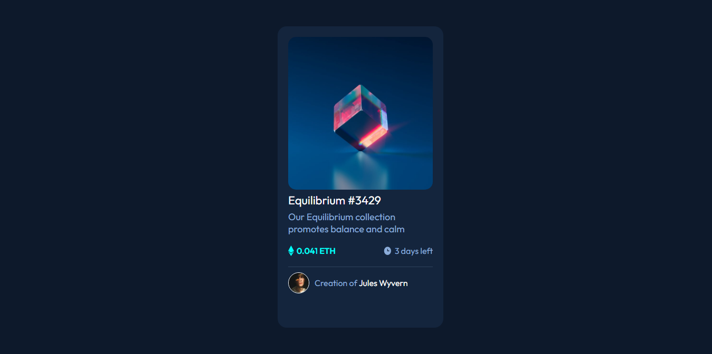

<h1 align="center">
  
</h1>

## 🚀 Tecnologias

Esse projeto foi desenvolvido com as seguintes tecnologias:

- HTML
- CSS

## 💻 Projeto

Esta é uma solução para o [desafio de componente de cartão de visualização NFT no Frontend Mentor](https://www.front//or.io/challenges/nft-preview-card-component-SbdUL_w0U).

## 🔖 Layout

Você pode visualizar o projeto através [desse link](https://desafio-nft.netlify.app/).

## :memo: Licença

Esse projeto está sob a licença MIT. Veja o arquivo [LICENSE](LICENSE.md) para mais detalhes.
